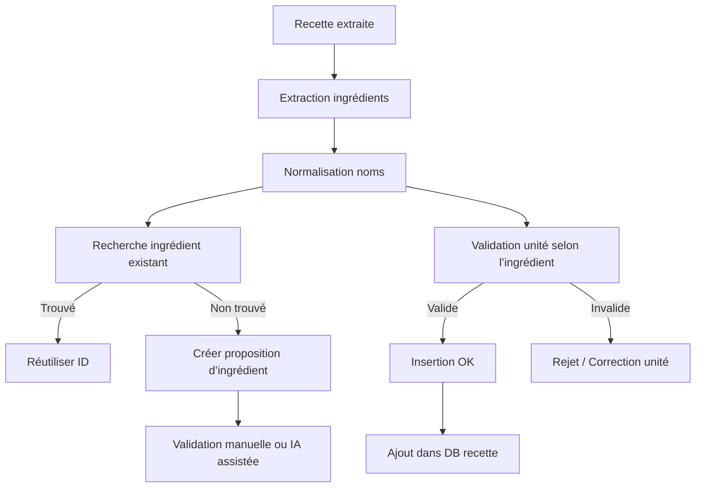

# 🧪 Dossier Étendu : Gestion d’Erreurs Critiques et Règles de Validation - Meal App Planner

Ce document étend le fichier original `gestion_erreurs_critiques_meal_appHAM.md` en intégrant des règles de validation plus détaillées, des exemples de code pour l'implémentation (conformes aux patterns de `.cursorrules`), et une liaison explicite avec les endpoints API de `Specs_API_Routes_Next.md`. L'objectif est d'assurer une validation robuste backend-side pour tous les flux (CRUD, IA), en respectant les business rules du projet. Toutes les validations utilisent Zod pour les schémas d'entrée, et des checks custom (ex. : cohérence, doublons) dans les services (ex. : RecipeService).

Les règles sont organisées par catégorie d'erreur, avec :
- **Risques** : Impacts potentiels.
- **Validations Requises** : Règles à appliquer (frontend + backend).
- **Endpoints Impactés** : Liens vers les routes API concernées.
- **Implémentation Exemple** : Stub de code TypeScript (service ou route).
- **Erreurs Retournées** : Format JSON standard `{ error: string, status: number }`.

Les validations critiques (ex. : doublons >85%, unités incohérentes) doivent lever une `AppError` custom pour logging et rollback de transactions Prisma.

---

## ❌ 1. Recettes Incomplètes ou Mal Structurées (Extension de l'original)

### 🧠 Problèmes Fréquents (Ajouts) :
- Instructions sans verbes d'action (ex. : liste statique sans "cuire", "mélanger").
- Quantités négatives ou zéro pour ingrédients.
- Temps de préparation/cuisson incohérents (ex. : prepTime > 120 min pour un "facile").

### ✅ Validations Requises (Étendu) :
- Champs obligatoires : `name` (non vide, min 5 chars), `instructions` (array min 2 éléments, chaque string contenant au moins un verbe d'action via regex simple : /cuire|mélanger|couper|ajouter|servir/i).
- Ingrédients : Min 1, avec `quantity > 0`, `unit` valide pour l'ingrédient.
- Temps : `prepTime + cookTime > 0`, cap à 300 min max (alerte si >180 pour cohérence).

### 📍 Endpoints Impactés :
- `/api/recipes` (POST/PUT) : Valider body avant création/update.
- `/api/ai/generate-recipe` (POST) : Appliquer après génération IA.

### 🛠️ Implémentation Exemple (RecipeService.ts) :
```typescript
import { z } from 'zod';
import { AppError } from '@/lib/errors'; // Custom error class
import { prisma } from '@/lib/db/prisma';

const verbRegex = /(cuire|mélanger|couper|ajouter|servir)/i;

export class RecipeService {
  async validateRecipe(data: RecipeCreateInput) {
    // Zod schema for basic validation
    const schema = z.object({
      name: z.string().min(5),
      instructions: z.array(z.string().refine(str => verbRegex.test(str), { message: 'Instruction must contain an action verb' })).min(2),
      ingredients: z.array(z.object({
        quantity: z.number().positive(),
        unit: z.enum(Object.values(UnitType)), // From Prisma enum
      })).min(1),
    });
    schema.parse(data); // Throws ZodError if invalid

    // Custom coherence check
    if (data.prepTime + data.cookTime > 300) {
      throw new AppError('Total time exceeds reasonable limit', 400);
    }
  }

  async create(data: RecipeCreateInput): Promise<Recipe> {
    await this.validateRecipe(data);
    // Proceed with embedding generation and Prisma create in transaction
  }
}
```

### ⚠️ Erreurs Retournées :
- `{ error: "Recipe name is required and must be at least 5 characters", status: 400 }`
- Log interne : Erreur + context (ex. : data.name).

---

## ❌ 2. Incohérence entre Type de Plat et Contenu (Extension)

### 🧠 Problèmes Fréquents (Ajouts) :
- "Plat principal" avec <3 ingrédients (trop simple).
- Ingrédients non adaptés (ex. : sucre dans un "plat principal" sans note dessert-like).

### ✅ Validations Requises (Étendu) :
- Score de cohérence (simple heuristique) : Pour `dishType = DESSERT`, vérifier absence de catégories salées (ex. : "Viandes", "Poissons") ; min ingrédients <6, cookTime <40.
- Si score <70% (calculé via count d'incohérences), alerte et demande confirmation (via IA chat si applicable).

### 📍 Endpoints Impactés :
- `/api/recipes` (POST/PUT).
- `/api/ai/generate-recipe` (POST) : Intégrer dans Chef Agent prompt.

### 🛠️ Implémentation Exemple (RecipeService.ts) :
```typescript
async checkCoherence(data: RecipeCreateInput) {
  if (data.dishType === DishType.DESSERT) {
    const saltyCategories = ['Viandes', 'Poissons']; // From Ingredient categories
    const hasSalty = data.ingredients.some(ing => saltyCategories.includes(ing.category));
    if (hasSalty || data.ingredients.length > 6 || data.cookTime > 40) {
      throw new AppError('Incoherent dish type: Desserts should not include salty ingredients or exceed 40 min cook time', 400);
    }
  }
  // Add more for other types
}
```

### ⚠️ Erreurs Retournées :
- `{ error: "Incoherent dish type with ingredients/content", status: 400 }`

---

## ❌ 3. Mauvais Mapping d'Ingrédients (Extension)

### 🧠 Problèmes Fréquents (Ajouts) :
- Unités non listées dans `Ingredient.units` (array d'UnitType).
- Quantités extrêmes (ex. : 1000 kg de sel) sans bornes contextuelles.

### ✅ Validations Requises (Étendu) :
- Pour chaque ingrédient : `unit` doit être dans `Ingredient.units` (query DB pour fetch).
- Bornes : Définir par catégorie (ex. : épices <100g, légumes <5kg) ; alerte si dépassé.

### 📍 Endpoints Impactés :
- `/api/recipes` (POST/PUT) : Lors d'ajout d'ingrédients.
- `/api/ingredients` (POST/PUT) : Valider units array.

### 🛠️ Implémentation Exemple (RecipeService.ts) :
```typescript
async validateIngredients(ingredients: { ingredientId: string, unit: UnitType, quantity: number }[]) {
  for (const ing of ingredients) {
    const dbIng = await prisma.ingredient.findUnique({ where: { id: ing.ingredientId } });
    if (!dbIng || !dbIng.units.includes(ing.unit)) {
      throw new AppError(`Invalid unit '${ing.unit}' for ingredient '${dbIng?.name}'`, 400);
    }
    if (dbIng.category === 'Épices' && ing.quantity > 100) {
      throw new AppError('Quantity exceeds reasonable limit for spices', 400);
    }
  }
}
```

### ⚠️ Erreurs Retournées :
- `{ error: "Invalid unit for ingredient: Use g or c.à.c for salt", status: 400 }`

---

## ❌ 4. Recettes en Doublon (Extension)

### 🧠 Problèmes Fréquents (Ajouts) :
- Similarité partielle (ex. : ingrédients 80% communs + instructions similaires).

### ✅ Validations Requises (Étendu) :
- Calcul similarité : Embed name + instructions + ingredients (concat text), cosine >0.85 (via pgvector ou lib JS).
- Si doublon, proposer fusion/variante via response (ex. : { warning: "Similar recipe found", similarId: uuid }).

### 📍 Endpoints Impactés :
- `/api/recipes` (POST).
- `/api/ai/generate-recipe` (POST).

### 🛠️ Implémentation Exemple (RecipeService.ts) :
```typescript
import { cosineSimilarity } from 'cosine-similarity'; // Or use Prisma $queryRaw for DB-side

async checkDuplicates(embedding: number[]): Promise<string | null> {
  const similar = await prisma.$queryRaw`
    SELECT id FROM recipes 
    ORDER BY embedding <=> ${embedding}::vector 
    LIMIT 1
  `;
  if (similar.length && cosineSimilarity(embedding, similar[0].embedding) > 0.85) {
    return similar[0].id; // Return ID for warning
  }
  return null;
}
```

### ⚠️ Erreurs Retournées :
- `{ error: "Duplicate recipe detected (similarity >85%)", similarId: "uuid", status: 409 }` (Conflict)

---
## ❌ 5. Validation IA des Ingrédients

Afin d'éviter les erreurs lors de l'extraction automatique des ingrédients par l'IA ou l'utilisateur, les points suivants doivent être mis en place :

### 1. Détection et traitement des doublons

- Tous les noms d'ingrédients doivent être **normalisés** :
  - Mise en minuscule
  - Suppression des adjectifs inutiles ("frais", "bio", etc.)
  - Singularisation des noms ("tomates" → "tomate")
- Utiliser une **recherche floue** (trigram, Levenshtein, pg_trgm) pour identifier les ingrédients similaires dans la base de données.
- Ajouter un champ `alias` ou `synonymes` dans la table "Ingrédients" pour faciliter la détection.

### 2. Validation d'unité de mesure

- Chaque ingrédient est associé à une ou plusieurs **unités valides** (définies dans la table "Ingrédients").
- Lors de l’ajout automatique ou manuel :
  - L’unité de mesure doit être vérifiée par rapport aux unités valides de l’ingrédient.
  - Si l’unité n’est pas conforme, l’ajout est bloqué ou corrigé.

**Exemple :**
> "2 litres de tomates" est refusé car l’unité "litres" n’est pas compatible avec "tomate" (attendue : "g", "pièce").

### 3. Contrôle de quantité contextuelle

- Implémenter des **bornes raisonnables** par ingrédient (ex : entre 5g et 100g pour le sel).
- Déclencher une **alerte douce** si la quantité dépasse un seuil atypique, pour validation manuelle.

### 4. Flux de validation simplifié



## ❌ 6. Ambiguïté dans les préférences familiales

### 🧠 Problèmes fréquents :
- “Mon fils n’aime pas la viande rouge” → ambiguïté : bœuf, agneau, canard ?
- “Il n’aime pas les légumes verts” → difficilement interprétable automatiquement

### ✅ Solutions proposées :
- Traduire chaque préférence vague en suggestions précises :
  - Ex : “Viande rouge” → Bœuf, Agneau, Gibier
  - Interface demande confirmation des éléments à exclure
- Ajouter un champ “ambigu” ou “à valider” dans la DB FamilyPreference
- Notification utilisateur pour validation a posteriori

---

## ❌ 7. Doublons ou surcharge dans la liste de courses

### 🧠 Problèmes fréquents :
- Ingrédients identiques non fusionnés (ex : 2 tomates + 150g de tomates)
- Articles en double si plusieurs menus utilisent les mêmes ingrédients

### ✅ Solutions proposées :
- Fusion des entrées identiques avec unités compatibles
- Si unités différentes → créer une alerte (non fusionnable)
- Affichage groupé par catégorie pour lisibilité
- Option IA : suggérer conversion d’unité si possible (ex : “150g ≈ 2 pièces”)

---

## ❌ 8. Problèmes liés aux dates et historique des repas

### 🧠 Problèmes fréquents :
- Même recette ajoutée plusieurs fois le même jour
- Repas marqué “mangé” avec une date future ou incohérente
- Confusion entre planification et consommation réelle

### ✅ Solutions proposées :
- Interdire insertion de plusieurs repas identiques le même jour pour un utilisateur sans confirmation explicite
- Vérification logique sur les dates (pas de dates futures sauf planification)
- Statut clair dans MealHistory : “planifié”, “validé”, “mangé”
- IA peut demander confirmation en cas de doute

---

## ❌ 5-8. Extensions pour les Autres Catégories
- **Validation IA Ingrédients** : Étendre flux Mermaid avec step pour embedding check ; normalise name via function (lowercase, singularize via lib comme pluralize).
- **Ambiguïté Préférences** : Ajouter Zod refine pour parser notes (ex. : détecter "viande rouge" → map to ingredients via prompt IA). Endpoint : `/api/family-preferences` (POST).
- **Doublons Liste Courses** : Fusion auto dans service (group by name, sum quantities if units compatibles). Endpoint : `/api/shopping/items` (POST).
- **Problèmes Dates/Historique** : Zod date().max(new Date()) pour non-future ; check duplicates same day. Endpoint : `/api/meal-history` (POST).
